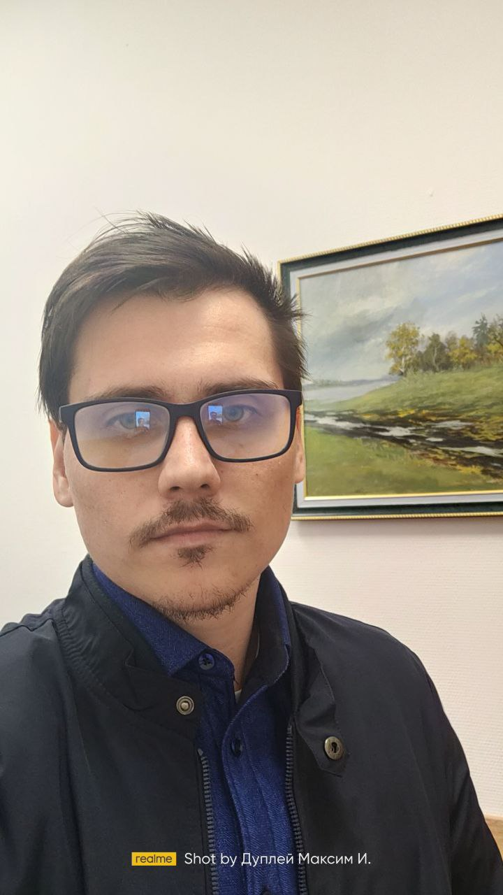

# scientific-publications

  
  

**Автор:** [Дуплей М.И.](https://stepik.org/users/150943726/teach) — старший преподаватель информационных технологий, аналитик, философ, музыкант и DevOps-инженер.  

Основатель школы по программированию [Maestro7IT](https://school-maestro7it.ru/)

## НАУЧНЫЕ ПУБЛИКАЦИИ

### 2025

- **DEVOPS-ПОДХОД К ВОСПРОИЗВОДИМОСТИ НАУЧНЫХ ВЫЧИСЛЕНИЙ: КОНТЕЙНЕРИЗАЦИЯ И ОРКЕСТРАЦИЯ ДЛЯ ЗАДАЧ ОБРАБОТКИ ИЗОБРАЖЕНИЙ И СИГНАЛОВ**  
  
  Исследование применения практик DevOps (Docker, CI/CD, Kubernetes) для обеспечения воспроизводимости экспериментов в научных задачах, связанных с обработкой изображений и радиосигналов (включая SDR). Предложена архитектура контейнеризованных рабочих процессов с поддержкой аппаратного ускорения и локальных устройств (например, RTL-SDR).

- **СОВМЕСТНЫЕ РОССИЙСКО-КИТАЙСКИЕ ПРОЕКТЫ В ОБЛАСТИ РАЗРАБОТКИ ПО (ВЫЗОВЫ И ВОЗМОЖНОСТИ)**  
  
  Анализ кооперации в сфере программного обеспечения между Россией и Китаем в условиях технологической автономии: правовые, культурные и технические аспекты взаимодействия.

- **ПРЕПОДАВАНИЕ LOW-LEVEL ПРОГРАММИРОВАНИЯ И ВСТРАИВАЕМЫХ СИСТЕМ В УСЛОВИЯХ ТЕХНОЛОГИЧЕСКОЙ АВТОНОМИИ**  
  
  Препринт, представленный на конференции по инженерному образованию. Рассматриваются методики обучения низкоуровневому программированию (C, ассемблер) и разработке для встраиваемых систем в условиях ограничений на импортные технологии.  

- **РОЛЬ СТУДЕНЧЕСКИХ ДВИЖЕНИЙ В СОЦИАЛЬНО-ПОЛИТИЧЕСКИХ ТРАНСФОРМАЦИЯХ XX ВЕКА: СРАВНИТЕЛЬНЫЙ АНАЛИЗ (НА ПРИМЕРЕ РОССИИ И ЗАПАДНОЙ ЕВРОПЫ)**  
  
  Историко-социологическое исследование, посвящённое влиянию студенческой активности на политические изменения в России и странах Западной Европы в XX веке.

- **ТЕХНОЛОГИЧЕСКИЙ СУВЕРЕНИТЕТ - КАК НОВЫЙ КРИТЕРИЙ ПРОМЫШЛЕННОЙ КОНКУРЕНТОСПОСОБНОСТИ**
  
  Статья посвящена анализу трансформации технологического суверенитета из политической концепции в конкретный критерий промышленной конкурентоспособности в условиях глобальной геополитической фрагментации. На фоне торговых войн, санкционных ограничений и дефицита полупроводников исследуются стратегии достижения технологической автономии в различных регионах мира.

  
  

> **При использовании материалов и цитировании обязательно указание авторства:**

> **При любом использовании (в том числе некоммерческом) требуется прямая ссылка на оригинальную публикацию и указание автора:** ORCID 0009-0007-7605-539X

> © Дуплей М.И., 2025. Все права на тексты, графику и сопутствующие материалы принадлежат автору.
