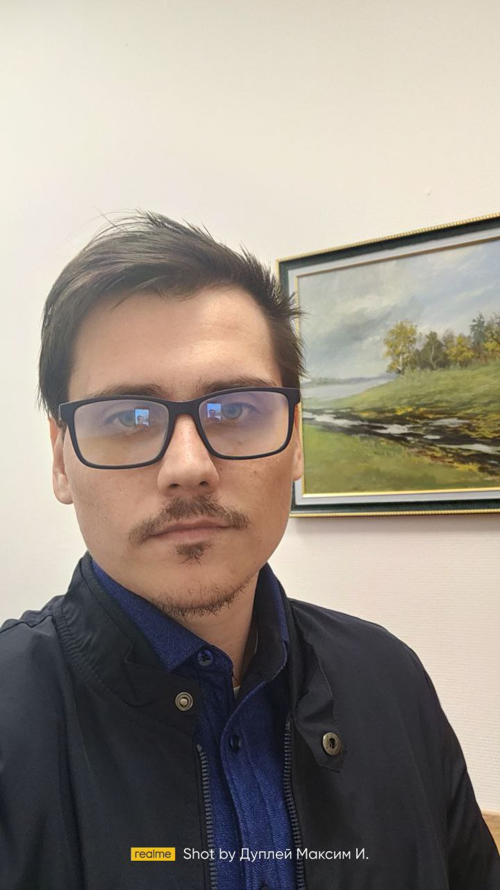

# scientific-publications

  
  

**Автор:** [Дуплей М.И.](https://stepik.org/users/150943726/teach) — старший преподаватель информационных технологий, аналитик, философ, музыкант и DevOps-инженер.

Основатель школы по программированию [Maestro7IT](https://school-maestro7it.ru/)

## НАУЧНЫЕ ПУБЛИКАЦИИ

### 2025

- **DEVOPS-ПОДХОД К ВОСПРОИЗВОДИМОСТИ НАУЧНЫХ ВЫЧИСЛЕНИЙ: КОНТЕЙНЕРИЗАЦИЯ И ОРКЕСТРАЦИЯ ДЛЯ ЗАДАЧ ОБРАБОТКИ ИЗОБРАЖЕНИЙ И СИГНАЛОВ**
  
  
  > Исследование применения практик DevOps (Docker, CI/CD, Kubernetes) для обеспечения воспроизводимости экспериментов в научных задачах, связанных с обработкой изображений и радиосигналов (включая SDR). Предложена архитектура контейнеризованных рабочих процессов с поддержкой аппаратного ускорения и локальных устройств (например, RTL-SDR).

- **СОВМЕСТНЫЕ РОССИЙСКО-КИТАЙСКИЕ ПРОЕКТЫ В ОБЛАСТИ РАЗРАБОТКИ ПО (ВЫЗОВЫ И ВОЗМОЖНОСТИ)**
  
  
  > Анализ кооперации в сфере программного обеспечения между Россией и Китаем в условиях технологической автономии: правовые, культурные и технические аспекты взаимодействия.

- **ПРЕПОДАВАНИЕ LOW-LEVEL ПРОГРАММИРОВАНИЯ И ВСТРАИВАЕМЫХ СИСТЕМ В УСЛОВИЯХ ТЕХНОЛОГИЧЕСКОЙ АВТОНОМИИ**
  
  
  > Препринт, представленный на конференции по инженерному образованию.
  
  > Рассматриваются методики обучения низкоуровневому программированию (C, ассемблер) и разработке для встраиваемых систем в условиях ограничений на импортные технологии.  

- **РОЛЬ СТУДЕНЧЕСКИХ ДВИЖЕНИЙ В СОЦИАЛЬНО-ПОЛИТИЧЕСКИХ ТРАНСФОРМАЦИЯХ XX ВЕКА: СРАВНИТЕЛЬНЫЙ АНАЛИЗ (НА ПРИМЕРЕ РОССИИ И ЗАПАДНОЙ ЕВРОПЫ)**
  
  
  > Историко-социологическое исследование, посвящённое влиянию студенческой активности на политические изменения в России и странах Западной Европы в XX веке.

- **ТЕХНОЛОГИЧЕСКИЙ СУВЕРЕНИТЕТ - КАК НОВЫЙ КРИТЕРИЙ ПРОМЫШЛЕННОЙ КОНКУРЕНТОСПОСОБНОСТИ**
  
  
  > Статья посвящена анализу трансформации технологического суверенитета из политической концепции в конкретный критерий промышленной конкурентоспособности в условиях глобальной геополитической фрагментации.
  
  > На фоне торговых войн, санкционных ограничений и дефицита полупроводников исследуются стратегии достижения технологической автономии в различных регионах мира.

- **ПОТЕНЦИАЛ И ОГРАНИЧЕНИЯ ГИБРИДНЫХ ОБРАЗОВАТЕЛЬНЫХ МОДЕЛЕЙ В ВУЗАХ И ШКОЛАХ**
  
  
  > Комплексный анализ гибридных (очно-дистанционных) моделей в российском образовательном контексте: методология интеграции цифровых и традиционных форматов, требования к инфраструктуре, педагогические компетенции, психологические барьеры и цифровое неравенство.
  
  > На основе анализа отечественного и международного опыта выявлены ключевые факторы успеха и предложены практические рекомендации для разных уровней образования — от школы до вуза.

- **ЭСТЕТИЧЕСКАЯ НОВИЗНА В МУЗЫКЕ, СГЕНЕРИРОВАННОЙ ИСКУССТВЕННЫМ ИНТЕЛЛЕКТОМ: КРИТЕРИИ, ИЗМЕРЕНИЯ И ФИЛОСОФСКИЕ ИМПЛИКАЦИИ**
  
  
  > **Междисциплинарное исследование эстетической новизны в ИИ-музыке:** формальные и перцептивные критерии, вычислительные метрики (`Librosa`, `MusicGen`, `Magenta`), валидация через слепые прослушивания и философская рефлексия в рамках феноменологии и эстетических традиций России, Европы и Восточной Азии.
  
  > **Особое внимание уделено парадоксу непреднамеренного творчества** — может ли алгоритм, лишённый интенциональности, порождать подлинную эстетическую новизну?

- **АНАЛИЗ ВЗАИМОДЕЙСТВИЯ И ПОТЕНЦИАЛА ОБРАЗОВАТЕЛЬНЫХ СООБЩЕСТВ В МЕССЕНДЖЕРАХ И СОЦИАЛЬНЫХ СЕТЯХ**
  
  
  > **Эмпирическое исследование образовательных сообществ в Telegram, VK и Discord:** анализ 25 групп, опрос 210 участников и контент-анализ 5200 сообщений.
  
  > Выявлены условия эффективной модерации, факторы вовлечённости и риски (фрагментация внимания, дефицит структуры).
  
  > Предложены методические рекомендации по интеграции неформальных цифровых сред в учебный процесс.

- **"ЗЕЛЁНАЯ" ПЕРЕЗАГРУЗКА ПРОМЫШЛЕННОСТИ: МЕЖДУ РЕГУЛЯЦИЕЙ И РЕАЛЬНОСТЬЮ**  
  
  
  > Анализ разрыва между регуляторными требованиями устойчивого развития и практическими ограничениями промышленности и образования в условиях технологической автономии.
  
  > Подчёркивается роль низкоуровневого программирования и встраиваемых систем как основы энергоэффективных, локализованных решений. 
  
  > Рассматриваются трансформации в инженерном образовании, вызванные «зелёной» перезагрузкой и цифровой локализацией.

- **АНАЛИЗ ЭФФЕКТИВНОСТИ SCRUM В УСЛОВИЯХ УДАЛЁННОЙ РАБОТЫ**  
  
  
  > **Теоретико-обзорный анализ на основе 52 источников и мета-анализа 17 эмпирических исследований:** выявлена продуктивность гибридных команд (94% от офисных при +23% удовлетворённости), предложена интегративная модель факторов эффективности и критерии успеха (SLA ≤4 ч, индекс психологической безопасности >4.2, цифровая зрелость CMMI 4–5).
  
  > Сделан акцент на российском контексте цифровой трансформации.

- **ЧЕТЫРЕ СТРАТЕГИИ БУДУЩЕГО: ИНТЕГРАТИВНАЯ МОДЕЛЬ ГИБКОГО УПРАВЛЕНИЯ БИЗНЕСОМ В УСЛОВИЯХ РАДИКАЛЬНОЙ НЕОПРЕДЕЛЁННОСТИ**  
  
  
  **Совместная работа с `И.А. Дробининым` и `Е.Д. Турнаевой`**
  
  > Предложена интегративная модель гибкого управления на основе четырёх стратегических парадигм из *Civilization: Beyond Earth* — `Контакт (исследование)`, `Гармония (адаптация)`, `Праведность (контроль)`, `Превосходство (трансформация)`
  
  > Рассматриваются управленческие архетипы, их сильные/слабые стороны и условия осознанного выбора или комбинирования стратегий в условиях радикальной неопределённости.

- **ИНКЛЮЗИВНОЕ ОБРАЗОВАНИЕ В РОССИЙСКИХ ШКОЛАХ: СИСТЕМНЫЕ БАРЬЕРЫ И ПРАКТИКИ ПРЕОДОЛЕНИЯ**  
  

  > **Анализ системных барьеров (кадровый дефицит, инфраструктурные ограничения, цифровая недостаточность) и предложенные решения:** повышение педагогической компетентности, сетевые методические центры, цифровые инструменты поддержки.
  
  > Исследование ориентировано на разработку региональных программ развития инклюзивного образования в России.

- **ИНТИМНАЯ ГИГИЕНА И КУЛЬТУРА ОТКРЫТОГО ДИАЛОГА: К ФОРМИРОВАНИЮ ЗДОРОВОГО ОТНОШЕНИЯ К ТЕЛУ И СЕКСУАЛЬНОСТИ В РОССИЙСКОМ ОБЩЕСТВЕ**  
    

  > Междисциплинарный анализ (`социология телесности`, `гигиеническая культура`, `сексуальное просвещение`) на основе данных по ИППП, опросов и рекомендаций `UNESCO/WHO`
  
  > **Выявлена связь между стыдом, информационной закрытостью и ростом рисков. Предложены рекомендации для образования, здравоохранения и медиа по снижению стигмы и укреплению репродуктивного здоровья.**

- **ЭТИЧЕСКИЕ ДИЛЕММЫ ПРИМЕНЕНИЯ ИСКУССТВЕННОГО ИНТЕЛЛЕКТА В ОБРАЗОВАТЕЛЬНОЙ СРЕДЕ: БАЛАНС МЕЖДУ ПЕРСОНАЛИЗАЦИЕЙ И ПРИВАТНОСТЬЮ**  
    

  > **Анализ этического напряжения между персонализацией обучения и защитой приватности:** обработка персональных данных, алгоритмическая непрозрачность, цифровое неравенство, дегуманизация.
  
  > Рассмотрены требования `ФЗ-152` и предложены принципы этического дизайна ИИ-инструментов в образовании.

- **АНАЛИЗ И ПРОГНОЗИРОВАНИЕ ИСПОЛЬЗОВАНИЯ РЕДКОЗЕМЕЛЬНЫХ МЕТАЛЛОВ В ВЫСОКОТЕХНОЛОГИЧНЫХ ОТРАСЛЯХ**

  *ANALYSIS AND FORECASTING OF RARE EARTH METALS USE IN HIGH-TECH INDUSTRIES*

  

  > **Комплексное исследование динамики спроса и предложения редкоземельных элементов (РЗЭ) в ключевых высокотехнологичных секторах:** электромобили, возобновляемая энергетика, электроника, оборонная промышленность.

  > Анализируются геополитические риски монополизации добычи и переработки РЗЭ (доминирование Китая — 60% мировой добычи, 85–90% переработки), стратегии диверсификации поставок, технологии рециклинга и альтернативные материалы.

  > **Прогнозные модели на основе временных рядов и сценарного анализа** показывают устойчивый рост потребления неодима, диспрозия и празеодима для постоянных магнитов (электромоторы, ветрогенераторы), а также критическую зависимость от китайских поставок при недостаточных темпах развития местных мощностей в США, ЕС и России.

  > Предложены рекомендации по формированию национальных стратегических резервов, стимулированию научных исследований в области материаловедения и развитию циркулярной экономики для снижения зависимости от импорта.

- **ИИ И ОДИНОЧЕСТВО: ИИ-КОМПАНЬОНЫ НОВОГО ПОКОЛЕНИЯ**

  *AI AND LONELINESS: NEW-GENERATION VIRTUAL COMPANIONS*

  

  

  

  

  

  

  > **Междисциплинарное исследование феномена ИИ-компаньонов в контексте глобальной эпидемии одиночества:** анализ психологических механизмов привязанности к виртуальным собеседникам, этических рисков (манипуляция эмоциями, конфиденциальность данных, замена реальных связей) и потенциала для поддержки ментального здоровья.

  > **Выявлена сильная корреляция (r = +0.94) между ростом социальной изоляции и использованием ИИ-компаньонов.** Пользователи демонстрируют высокую социальную тревожность, склонность к антропоморфизму и потребность в принятии при сниженном критическом мышлении.

  > **Основные этические риски:** манипуляция эмоциями (9/10), конфиденциальность данных (8/10), коммерциализация уязвимостей (8/10). Сравнительный анализ показывает, что лидерами по внедрению являются Япония и Южная Корея (высокое одиночество + развитая инфраструктура), а Германия демонстрирует баланс между внедрением и социальной поддержкой.

  > **Исследование выявляет три фазы взаимодействия:** начальное любопытство (месяцы 0–3), "медовый месяц" с пиком удовлетворённости (месяцы 3–8) и фаза зависимости с падением реальной социальной активности (месяцы 8+).

  > Предложены рекомендации для разработчиков, регуляторов и специалистов ментального здоровья по этичному проектированию ИИ-компаньонов и профилактике цифровой зависимости.

- **ВЛИЯНИЕ AI-АССИСТЕНТОВ НА МЕТАКОГНИТИВНЫЕ НАВЫКИ СТУДЕНТОВ ПРИ РЕШЕНИИ ЗАДАЧ ПРОГРАММИРОВАНИЯ**

  *THE IMPACT OF AI ASSISTANTS ON STUDENTS' METACOGNITIVE SKILLS IN SOLVING PROGRAMMING PROBLEMS*

  

  

  

  

  > *Массовое внедрение AI-ассистентов (**`GitHub` `Copilot`, `ChatGPT`**) в учебные процессы трансформирует методику обучения программированию, однако их влияние на формирование метакогнитивных навыков (**`планирование`, `мониторинг`, `рефлексия`**) остаётся недостаточно изученным.*

  > **Цель исследования** — количественно и качественно оценить, как использование AI-инструментов влияет на развитие метакогнитивной самостоятельности студентов технических вузов.

- **НАДЕЖНЫЕ АДАПТИВНЫЕ МЕТОДЫ ДЛЯ ГЛУБОКОГО ОБУЧЕНИЯ - АДАПТИВНАЯ ОПТИМИЗАЦИЯ ПРИ НАЛИЧИИ ГРАДИЕНТНОГО ШУМА С ТЯЖЕЛЫМИ ХВОСТАМИ**

  *ROBUST ADAPTIVE METHODS FOR DEEP LEARNING - ADAPTIVE OPTIMIZATION IN THE PRESENCE OF HEAVY-TAILED GRADIENT NOISE*

  

  

  > Современные методы глубокого обучения сталкиваются с проблемами при обучении на данных или архитектурах, порождающих распределения градиентов с тяжелыми хвостами — типичная ситуация в задачах компьютерного зрения с аномалиями, языковом моделировании с редкими токенами или федеративном обучении с не-IID клиентами.
  
  > Несмотря на практическую эффективность адаптивных оптимизаторов (*например, `Adam`*), их теоретический анализ ограничен субгауссовскими предположениями, что создает пробел в робастности реальных систем.

  > **Представляю вашему вниманию AdaHeavy** — принципиальную методику адаптивной оптимизации при слабых предположениях о моментах.

  > Данный подход интегрирует моментно-адаптивный клиппинг градиентов в `Adam` и `AdaGrad`, динамически настраивая пороги клиппинга на основе (1+δ) -го момента (δ∈(0,1] ) исторических градиентов.
  
  > Доказано, что `AdaHeavy` обеспечивает сходимость O(Tlog(1/δ)) с вероятностью 1−δ для невыпуклых липшицевых функций — первый результат для адаптивных методов при тяжелых хвостах.

  > *Анализ основан на новом подходе стохастического дрейфа функции Ляпунова, учитывающем зависимость между порогами клиппинга и историей градиентов.*

- **ТРАНСФОРМЕРНАЯ АРХИТЕКТУРА С ЭФФЕКТИВНЫМ МЕХАНИЗМОМ ВНИМАНИЯ ДЛЯ ДЛИННЫХ ПОСЛЕДОВАТЕЛЬНОСТЕЙ**

  *TRANSFORMER ARCHITECTURE WITH AN EFFICIENT ATTENTION MECHANISM FOR LONG SEQUENCES*

  

  > Представлен оптимизированный механизм внимания для обработки сверхдлинных последовательностей (10^5+ токенов) с субквадратичной сложностью. Подход сочетает блочную факторизацию, адаптивное прореживание ключей и спектрально-ядровую аппроксимацию, снижая пиковое потребление памяти до O(n log n).
  > Демонстрируется ускорение обучения и повышение качества (перплексия, F1) на задачах долгосрочного моделирования текста, многообъёмных документов, временных рядов и биоинформатики по сравнению с Longformer / Performer.

---

- **🛰️ ISS Telemetry Analyzer**

  > Анализатор телеметрических данных Международной космической станции.

  > Также присутсвует веб-интерфейс для `ISS Telemetry Analyzer`, который позволяет визуализировать результаты анализа телеметрических данных Международной космической станции в удобном браузерном интерфейсе.

- **🌞 HelioPy**

  > `Open-source` библиотека для анализа солнечной активности и прогнозирования космической погоды на `Python`

  
  

> **При использовании материалов и цитировании обязательно указание авторства:**

> **При любом использовании (в том числе некоммерческом) требуется прямая ссылка на оригинальную публикацию и указание автора:** `ORCID: 0009-0007-7605-539X`

> `© Дуплей М.И., 2025` *Все права на тексты, графику и сопутствующие материалы принадлежат автору.*
