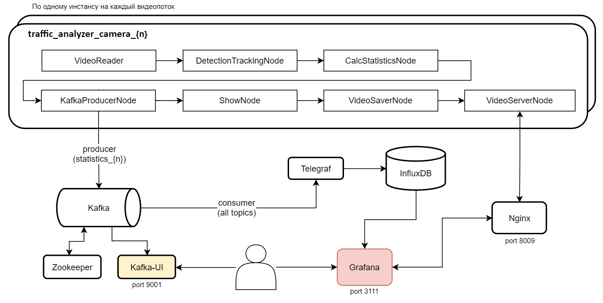
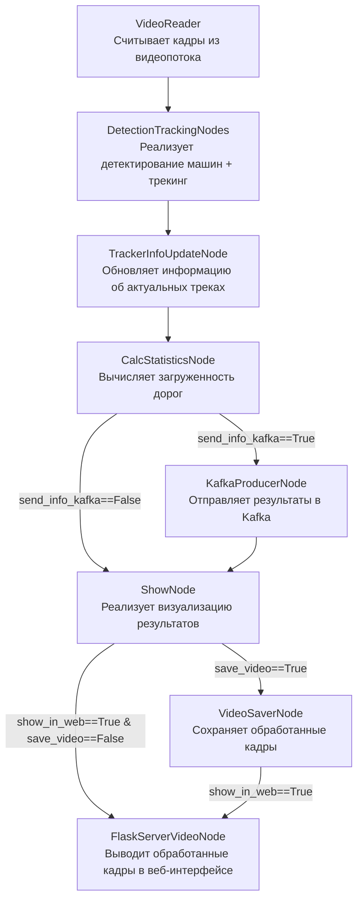

# Анализ трафика на круговом движении 
**Production версия с множеством камер, базой данных временных рядов Influx и дашбордами в Grafana**

Данная программа осуществляет анализ входящего трафика на участке кругового движения. Алгоритм определяет загруженность примыкающих дорог и выводит интерактивную статистику.

Подробный туториал по проекту и его архитектуре - [__ссылка на видео__](https://vk.com/video-145052891_456247910)

## Установка и запуск:

Склонируйте репозиторий:
```

```
После этого необходимо в главной директории  проекта создать файл с переменными окружения, которые будут прокинуты в контейнеры Grafana и Influx. Для этого создайте файл `.env` и укажите подобный текст с паролями и логинами к сервисам:
```
INFLUXDB_ADMIN_USER=admin
INFLUXDB_ADMIN_PASSWORD=admin
GRAFANA_ADMIN_USER=admin
GRAFANA_ADMIN_PASSWORD=admin
KAFKA_USERNAME=traffic
KAFKA_PASSWORD=traffic-secret
```
Далее запустите проект с помощью этой команды:
```
docker compose -p traffic_analyzer up -d --build
```

Для того, чтобы попасть на дашборд в Grafana надо после запуска компоуза перейти по этой [ссылке](http://localhost:3111/d/edycr94pt2mm8b/dashboard-trafficanalyzer-1-camera-influx?orgId=1&refresh=5s). Введите логин `admin` и пароль `admin`.
У каждой камеры свой дашборд между которыми можно переходит по кнопке:


Каждая новая камера добавляется в компоузе как +1 инстанс бекенда traffic_analyzer_camera_{n}, в котором надо указать лишь разные scr и конфигурации через переменные окружения сервиса.

## Как запустить локально в Python без дополнительных микросервисов:
```
# ставим библиотеки:
python -m pip install --upgrade pip
pip install "numpy<2"
pip install cython_bbox==0.1.5 lap==0.4.0 
pip install torch==2.3.1 torchvision==0.18.1 --index-url https://download.pytorch.org/whl/cu121
pip install -r requirements.txt

# запускаем код:
python main_optimized.py pipeline.send_info_kafka=False
```
Результат работы программы можно увидеть, перейдя по [ссылке](http://127.0.0.1:8100/)

---
## Архитектура проекта:

Проект представляет собой систему для анализа видео в реальном времени, работающую с RTSP-стримами или MP4-файлами. Основной сервис **traffic_analyzer_camera_{n}** обрабатывает кадры, извлекает аналитические данные (например, число машин на круговом участке, загруженность примыкающих дорог) и отправляет их в брокер сообщений **Kafka**. Для каждой камеры записись realtime статистики ведется в свой топик *statistics_{n}*. Данные из Kafka автоматически записываются в базу временных рядов **InfluxDB** с помощью **Telegraf**. InfluxDB оптимальна для хранения потоковых данных благодаря высокой производительности и поддержке больших объемов информации.

Для визуализации данных используется **Grafana**, которая подключается к InfluxDB и отображает аналитику в виде интерактивных дашбордов. Это позволяет отслеживать ключевые метрики в реальном времени, строить графики и анализировать тренды.

#### Основные компоненты:
1. **traffic_analyzer_camera_{n}**: обрабатывает видеопоток по номеру n, отправляет данные в Kafka.
2. **Kafka**: временное хранение и передача данных.
3. **Telegraf**: перенос данных из Kafka в InfluxDB.
4. **InfluxDB**: хранение аналитических данных.
5. **Grafana**: визуализация данных из InfluxDB в интерактивных дашбордах.
6. **Nginx**: выступает в роли реверс-прокси для объединения всех результирующих Flask-стримов обработанного видео на одном порту с разными эндпоинтами. Это позволяет удобно управлять доступом к видеостримам и обеспечивает единую точку входа для всех камер.



## Рассмотрим, как реализован код главного сервиса по обработке видеопотока:

Каждый кадр (объект FrameElement) последовательно проходит через ноды, и в атрибуты этого объекта постепенно добавляется все больше и больше информации.


---

## Работа с программой:
Перед запуском необходимо в файле __configs/app_config.yaml__ указать все желаемые параметры. Далее можно запускать код.

Чтобы запустить проект с определенным видео, необходимо указать путь к нему в докер компоузе переменной окружения. Можно вместо пути к файлу указать ссыку на rtsp поток. Там же в переменных окружения контейнера можно указать путь до json файла с указанными координатами полигонов прилегающих дорог. 

#### <ins>Варианты запуска для mp4 файлов:<ins>

**main.py** - основной код проекта, реализующий в цикле прогон кадров через все ноды.

**main_optimized.py** - Оптимизированный код main.py с помошью multiprocessing. Позволяет достичь более высокой скорости обработки (свыше 35 кадров в секунду), поскольку все ресурсоемкие операции распределены между независимыми процессами, работающими параллельно.

#### <ins>Дополнительные варианты запуска (только для риалтайм rtsp потоков):<ins>

**main_stream_optimized.py** — версия для работы с потоковым видео в реальном времени, которая обеспечивает обработку только самых актуальных кадров без использования буфера. Это достигается за счет того, что кадры обрабатываются в отдельном процессе, а основной процесс всегда берет для обработки только последний доступный кадр.

**main_stream_optimized_v2.py** — улучшенная версия main_stream_optimized.py. Основное отличие заключается в том, что при завершении или сбое одного из процессов автоматически завершается и второй процесс. Контроль за состоянием процессов осуществляется через метод `process.is_alive()`, что обеспечивает более надежное управление жизненным циклом процессов.

---
## Примеры работы кода:

__Пример работы алгоритма c выводом статистики__: каждая машина отображается цветом, соответствующим дороге, с которой она прибыла к круговому движению + выводится значение числа видимых машин + значения интенсивности входного потока (число машин в минуту с каждой входящей дороги). <br/>Отображается таким образом при выборе в конфигурации show_node.show_info_statistics=True 


Отключить отображение окна со статистикой можно при выборе в конфигурации show_node.show_info_statistics=False <br/>
Чтобы наблюдать fps обработки как в первом представленном примере, необходимо в конфиге указать show_node.draw_fps_info=True.  

---
__Пример режима демонстрации результатов трекинга машин__ (каждый id своим уникальным цветом отображается) <br/>
Отображается таким образом при выборе в конфигурации show_node.show_track_id_different_colors=True 


---

## Существующие версии кода:

В проекте специально предусмотрено множество веток, реализующих разные уровни разработки масштабного Computer Vision проекта.

Например, в ветке **main** Docker Compose позволяет поднять сторонние сервисы (Grafana для визуализации и базу данных PostgreSQL). Однако основной код, реализующий бекенд, необходимо запускать локально с помощью имеющегося на компьютере Python.

Структура ветвления Git проекта представлена ниже:

```
main
└── prod_docker_version
    └── multicamera
        ├── feature/triton
        └── feature/influx
```
