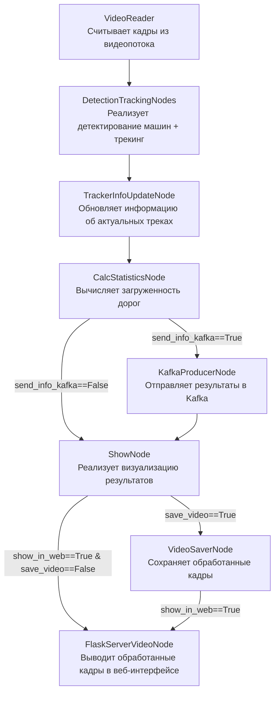

# 🚗 Анализ трафика на круговом движении

[](https://www.python.org/)
[](https://www.docker.com/)
[](LICENSE)
[](https://github.com/ultralytics/ultralytics)

**Production-ready система с поддержкой множества камер, базой данных временных рядов InfluxDB и интерактивными дашбордами в Grafana**

Система осуществляет анализ входящего трафика на участке кругового движения в режиме реального времени. Алгоритм определяет загруженность примыкающих дорог и предоставляет интерактивную статистику с визуализацией.

📺 [**Видеоинструкция по проекту и его архитектуре**](https://vk.com/video-145052891_456247910)

## 📋 Содержание

- [Быстрый старт](#-быстрый-старт)
- [Локальный запуск](#-как-запустить-локально-в-python-без-дополнительных-микросервисов)
- [Разработка](#-разработка)
- [Архитектура проекта](#️-архитектура-проекта)
- [Код главного сервиса](#-код-главного-сервиса-по-обработке-видеопотока)
- [Работа с программой](#-работа-с-программой)
- [Примеры работы](#-примеры-работы-кода)
- [Версии кода](#-существующие-версии-кода)

## 🚀 Быстрый старт

### Клонирование репозитория

```bash
cd TrafficAnalyzer
```

### Настройка переменных окружения

Создайте файл `.env` в корневой директории проекта с паролями и логинами к сервисам:

```env
INFLUXDB_ADMIN_USER=admin
INFLUXDB_ADMIN_PASSWORD=admin
GRAFANA_ADMIN_USER=admin
GRAFANA_ADMIN_PASSWORD=admin
KAFKA_USERNAME=traffic
KAFKA_PASSWORD=traffic-secret
```

### Запуск проекта

```bash
docker compose -p traffic_analyzer up -d --build
```

### Доступ к Grafana

После запуска перейдите на [дашборд Grafana](http://localhost:3111/d/edycr94pt2mm8b/dashboard-trafficanalyzer-1-camera-influx?orgId=1&refresh=5s).

- **Логин**: `admin`
- **Пароль**: `admin`

У каждой камеры свой дашборд, между которыми можно переключаться:


### Добавление новых камер

Каждая новая камера добавляется в `docker-compose.yaml` как отдельный сервис `traffic_analyzer_camera_{n}` с уникальными параметрами через переменные окружения.

## 💻 Как запустить локально в Python без дополнительных микросервисов

### Установка зависимостей

```bash
# Обновление pip
python -m pip install --upgrade pip

# Установка основных зависимостей
pip install "numpy<2"
pip install cython_bbox==0.1.5 lap==0.4.0

# Установка PyTorch (CUDA 12.1)
pip install torch==2.3.1 torchvision==0.18.1 --index-url https://download.pytorch.org/whl/cu121

# Установка остальных зависимостей
pip install -r requirements.txt
```

### Запуск

```bash
python main_optimized.py pipeline.send_info_kafka=False
```

Результат работы доступен по адресу: [http://127.0.0.1:8100/](http://127.0.0.1:8100/)

---

## 🛠️ Разработка

### Быстрая настройка окружения разработки

Для автоматической настройки окружения разработки используйте скрипт:

```powershell
.\scripts\dev_setup.ps1
```

Этот скрипт:
- ✅ Создаст виртуальное окружение `.venv`
- ✅ Установит все зависимости из `requirements-dev.txt`
- ✅ Настроит pre-commit hooks для автоматических проверок
- ✅ Создаст `.env` файл из шаблона

### Полезные команды для разработки

#### Проверка качества кода

```powershell
# Полная проверка (форматирование, линтинг, типизация)
.\scripts\code_quality.ps1

# С автоматическим исправлением
.\scripts\code_quality.ps1 -Fix

# Только проверка форматирования
.\scripts\code_quality.ps1 -SkipLint -SkipTypes
```

#### Запуск тестов

```powershell
# Запуск всех тестов
.\scripts\run_tests.ps1

# С покрытием кода
.\scripts\run_tests.ps1 -Coverage

# Только быстрые тесты (исключая медленные)
.\scripts\run_tests.ps1 -Fast

# Verbose режим
.\scripts\run_tests.ps1 -Verbose
```

#### Форматирование кода

```bash
# Автоформатирование с Black
black . --line-length=100

# Сортировка импортов
isort . --profile=black
```

#### Линтинг

```bash
# Проверка с Ruff (быстрый линтер)
ruff check .

# С автоисправлением
ruff check . --fix
```

#### Проверка типов

```bash
# MyPy проверка типизации
mypy . --ignore-missing-imports
```

### Структура проекта

```
traffic-analyzer/
├── configs/              # Конфигурационные файлы
│   ├── app_config.yaml   # Основная конфигурация
│   └── entry_exit_lanes.json
├── nodes/                # Ноды обработки (модульная архитектура)
│   ├── DetectionTrackingNodes.py
│   ├── CalcStatisticsNode.py
│   └── ...
├── elements/             # Элементы данных
│   ├── FrameElement.py
│   └── TrackElement.py
├── utils_local/          # Утилиты
│   ├── logger.py
│   ├── metrics.py
│   └── utils.py
├── byte_tracker/         # ByteTracker алгоритм
├── tests/                # Тесты
│   ├── test_utils.py
│   ├── test_integration.py
│   └── conftest.py
├── scripts/              # Скрипты автоматизации
│   ├── dev_setup.ps1
│   ├── code_quality.ps1
│   └── run_tests.ps1
├── main_optimized.py     # Основной файл (multiprocessing)
├── pyproject.toml        # Конфигурация инструментов
├── requirements.txt      # Production зависимости
└── requirements-dev.txt  # Development зависимости
```

### Рекомендации по коду

- ✅ Используйте **type hints** для всех функций
- ✅ Добавляйте **docstrings** в Google Style
- ✅ Покрывайте новый код **тестами** (минимум 50% coverage)
- ✅ Запускайте `pre-commit` перед коммитом
- ✅ Следуйте **PEP 8** (автоматически с black)
- ✅ Используйте **константы** вместо magic numbers

### Pre-commit hooks

После установки (`pre-commit install`) автоматически выполняются проверки:
- Форматирование (black, isort)
- Линтинг (ruff)
- Проверка типов (mypy)
- Безопасность (bandit)
- YAML/JSON валидация

---

## 🏗️ Архитектура проекта

Проект представляет собой систему для анализа видео в реальном времени, работающую с RTSP-стримами или MP4-файлами. Основной сервис **traffic_analyzer_camera_{n}** обрабатывает кадры, извлекает аналитические данные (например, число машин на круговом участке, загруженность примыкающих дорог) и отправляет их в брокер сообщений **Kafka**. Для каждой камеры запись realtime статистики ведется в свой топик *statistics_{n}*. Данные из Kafka автоматически записываются в базу временных рядов **InfluxDB** с помощью **Telegraf**. InfluxDB оптимальна для хранения потоковых данных благодаря высокой производительности и поддержке больших объемов информации.

Для визуализации данных используется **Grafana**, которая подключается к InfluxDB и отображает аналитику в виде интерактивных дашбордов. Это позволяет отслеживать ключевые метрики в реальном времени, строить графики и анализировать тренды.

### Основные компоненты

1. **traffic_analyzer_camera_{n}**: обрабатывает видеопоток по номеру n, отправляет данные в Kafka.
2. **Kafka**: временное хранение и передача данных.
3. **Telegraf**: перенос данных из Kafka в InfluxDB.
4. **InfluxDB**: хранение аналитических данных.
5. **Grafana**: визуализация данных из InfluxDB в интерактивных дашбордах.
6. **Nginx**: выступает в роли реверс-прокси для объединения всех результирующих Flask-стримов обработанного видео на одном порту с разными эндпоинтами. Это позволяет удобно управлять доступом к видеостримам и обеспечивает единую точку входа для всех камер.


## 🔧 Код главного сервиса по обработке видеопотока

Каждый кадр (объект FrameElement) последовательно проходит через ноды, и в атрибуты этого объекта постепенно добавляется все больше и больше информации.



---

## ⚙️ Работа с программой

Перед запуском необходимо в файле `configs/app_config.yaml` указать все желаемые параметры. Далее можно запускать код.

Чтобы запустить проект с определенным видео, необходимо указать путь к нему в docker compose переменной окружения. Можно вместо пути к файлу указать ссылку на rtsp поток. Там же в переменных окружения контейнера можно указать путь до json файла с указанными координатами полигонов прилегающих дорог.

### Варианты запуска для mp4 файлов

**main.py** - основной код проекта, реализующий в цикле прогон кадров через все ноды.

**main_optimized.py** - Оптимизированный код main.py с помощью multiprocessing. Позволяет достичь более высокой скорости обработки (свыше 35 кадров в секунду), поскольку все ресурсоемкие операции распределены между независимыми процессами, работающими параллельно.

### Дополнительные варианты запуска (только для риалтайм rtsp потоков)

**main_stream_optimized.py** — версия для работы с потоковым видео в реальном времени, которая обеспечивает обработку только самых актуальных кадров без использования буфера. Это достигается за счет того, что кадры обрабатываются в отдельном процессе, а основной процесс всегда берет для обработки только последний доступный кадр.

**main_stream_optimized_v2.py** — улучшенная версия main_stream_optimized.py. Основное отличие заключается в том, что при завершении или сбое одного из процессов автоматически завершается и второй процесс. Контроль за состоянием процессов осуществляется через метод `process.is_alive()`, что обеспечивает более надежное управление жизненным циклом процессов.

---

## 🎬 Примеры работы кода

### Пример работы алгоритма c выводом статистики

Каждая машина отображается цветом, соответствующим дороге, с которой она прибыла к круговому движению + выводится значение числа видимых машин + значения интенсивности входного потока (число машин в минуту с каждой входящей дороги).

Отображается таким образом при выборе в конфигурации `show_node.show_info_statistics=True`


Отключить отображение окна со статистикой можно при выборе в конфигурации `show_node.show_info_statistics=False`

Чтобы наблюдать fps обработки как в первом представленном примере, необходимо в конфиге указать `show_node.draw_fps_info=True`.

---

### Пример режима демонстрации результатов трекинга машин

Каждый id отображается своим уникальным цветом.

Отображается таким образом при выборе в конфигурации `show_node.show_track_id_different_colors=True`


---

## 📦 Существующие версии кода

В проекте специально предусмотрено множество веток, реализующих разные уровни разработки масштабного Computer Vision проекта.

Например, в ветке **main** Docker Compose позволяет поднять сторонние сервисы (Grafana для визуализации и базу данных PostgreSQL). Однако основной код, реализующий бекенд, необходимо запускать локально с помощью имеющегося на компьютере Python.

Структура ветвления Git проекта представлена ниже:

```text
main
└── prod_docker_version
    └── multicamera
        ├── feature/triton
        └── feature/influx
```

---

## 📄 License

MIT License - см. файл [LICENSE](LICENSE)

## 👥 Contributing

Contributions are welcome! Please feel free to submit a Pull Request.
